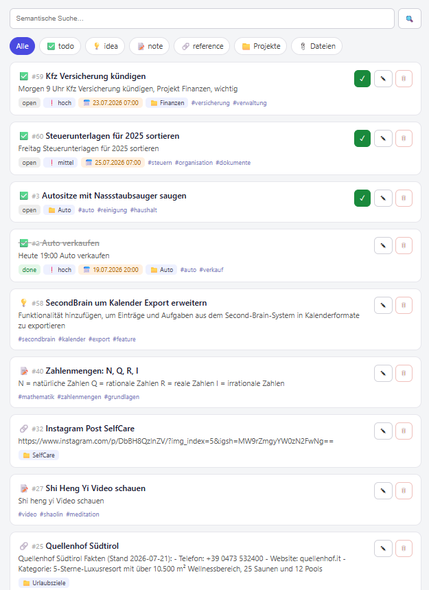
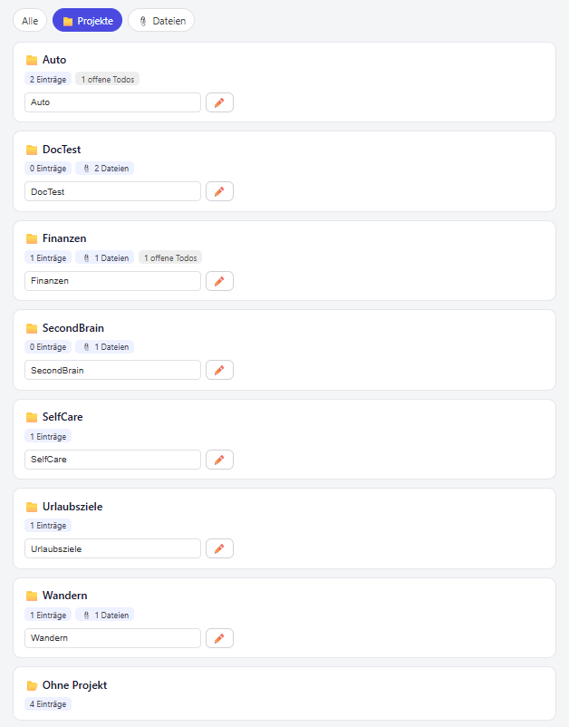
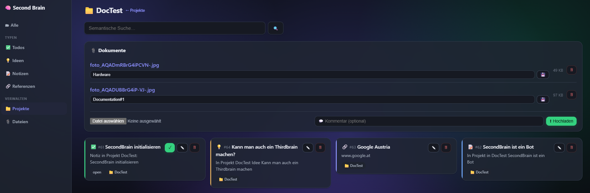
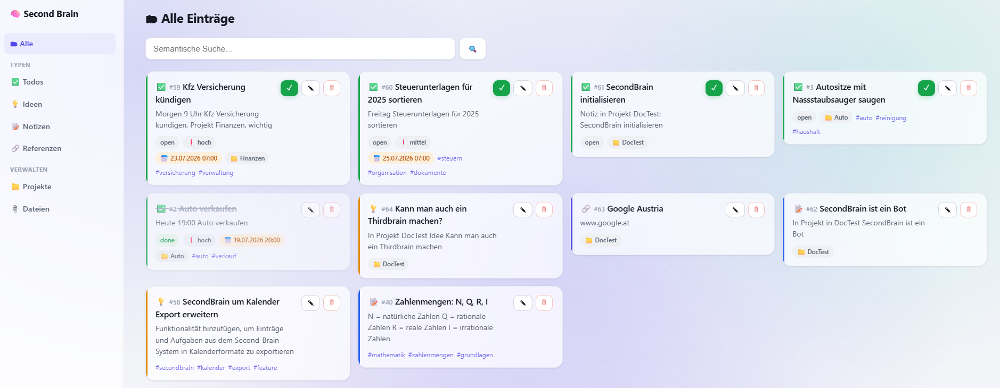
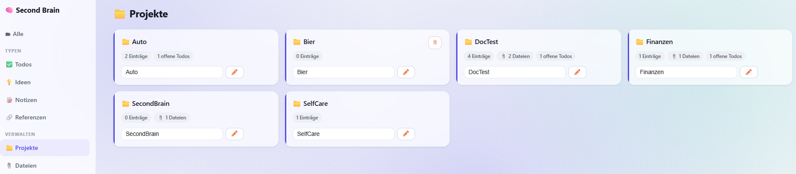
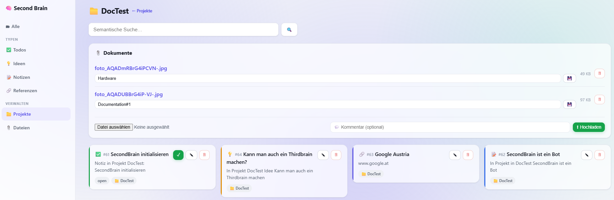

# Second Brain 🧠

[](https://github.com/FloW572/Second-Brain/actions/workflows/ci.yml)

Ein persönliches, selbst gehostetes „Second Brain": Todos, Ideen, Projekte und Notizen
werden per **Telegram** — als **Text oder Sprachnachricht** — vom Handy erfasst, in
**PostgreSQL + pgvector** gespeichert und von **Claude** ausgewertet, z.B.
*„Was sollte ich heute zuerst tun?"*. Fällige Todos meldet der Bot **proaktiv** als Erinnerung.

## Demo

Ein kurzer Blick in den Alltag: eine Notiz per Telegram erfassen (Text oder Sprache), begründet
nachfragen — und mit `/stats` jederzeit die geschätzten Kosten im Blick behalten.

<p align="center">
  
</p>

**Web-Dashboard** — dieselbe Datenbank im Browser, mit automatischem **Hell-/Dunkelmodus** (oben dunkel, unten hell):

| Alle Einträge | Projekte (umbenennen/löschen) | In einem Projekt |
|:---:|:---:|:---:|
|  |  |  |
|  |  |  |

**Was dieses Projekt beinhaltet — in 30 Sekunden:**
- **RAG in echt:** hybride Suche (Vektor **+** deutscher Volltext, RRF-Fusion, Distanz-Schwelle)
  über selbst erfasste Notizen — eine bewusst getunte Retrieval-Pipeline, kein Framework-Copy-paste.
- **Agentische Tool-Nutzung:** Claude liest und verändert die echten Daten über Tools, statt zu raten.
- **Gemessen statt geraten:** ein **Eval-Harness** bewertet Router-, Extraktions-, Retrieval- und
  Antwort-Qualität (hit@k, MRR, LLM-as-Judge) — siehe [Evals](#evals).
- **Betreibbar:** Kosten-/Token-/Latenz-Logging + `/stats`; self-hosted per Docker mit **lokalen**
  Embeddings und **lokaler** Spracherkennung (Datenhoheit).
- **Engineering:** klare Modul-Trennung, idempotente Migrationen, Unit-Tests + CI.

## Architektur

```
Handy ──Telegram──▶ Bot (Polling) ──▶ Backend (Python)      Browser ──▶ Web-Dashboard :8001
 Text · 🎙 Voice · Datei/Foto           ├─ Voice: faster-whisper (lokal) → Text
                                        ├─ Router (Claude Haiku): capture | query
                                        ├─ Capture: Claude strukturiert → Embedding (lokal) → DB
                                        ├─ Query: agentischer Claude-Loop (Opus) mit Tools
                                        │    └─ enrich_item → Anthropic-Websuche → Fakten
                                        └─ Loops: Erinnerungen · Tages-Digest · Wochen-Review
                                        │
                                        ▼
                              PostgreSQL 16 + pgvector
                              (projects · items[+embedding+fts] · documents) + Datei-Volume
```

- **Erfassen:** Text oder Sprachnachricht (Voice wird lokal transkribiert) → Claude extrahiert
  Typ/Titel/Fälligkeit (mit Uhrzeit)/Priorität/Projekt/Tags → lokales, multilinguales Embedding
  (bge-m3) → gespeichert.
- **Fragen & Handeln:** Claude nutzt Tools, liest bzw. verändert die echten Daten und antwortet
  begründet — statt zu raten; für Rückfragen merkt es sich den Gesprächskontext.
- **Anreichern:** „Ergänze Referenz X um relevante Fakten" → Claude recherchiert per **Websuche**
  die wichtigsten Fakten (z.B. Adresse/Telefon/Bewertung) und hängt sie an den Eintrag an.
- **Erinnern:** Ein Hintergrund-Loop prüft jede Minute fällige, offene Todos und schickt genau
  **eine** proaktive Telegram-Nachricht pro Todo.
- **Proaktiv:** täglicher **Digest** (Morgenüberblick) und wöchentliches **Review** (Rückblick +
  Fokus), automatisch zur eingestellten Zeit oder on-demand per `/digest` / `/review`.

## Funktionen

| Bereich | Was |
|---|---|
| **Erfassen** | Freitext **und Sprachnachrichten** → strukturierte Todos / Ideen / Notizen / Referenzen; ein `#Projektname` im Text ordnet direkt einem Projekt zu |
| **Suche** | hybrid: semantisch (pgvector) **+** deutscher Volltext, fusioniert mit RRF, mit Distanz-Schwelle |
| **Fragen** | agentischer Claude-Loop, begründete Antworten aus den echten Daten |
| **Gedächtnis** | kurzes Konversations-Gedächtnis pro Chat für Rückfragen; `/reset` startet neu |
| **Bearbeiten** | `update_item` (Titel/Inhalt/Typ/Fälligkeit/Priorität/Status/Projekt/Tags), `complete_item`, `delete_item` |
| **Projekte** | automatische Zuordnung beim Erfassen; `create_project`, `rename_project` (Einträge bleiben dran), `delete_project` (nur leere); Projekt-Ansicht im Dashboard |
| **Anreichern** | „Ergänze Eintrag X um relevante Fakten" → Claude recherchiert per **Websuche** die wichtigsten typgerechten Fakten (Hotel: Adresse/Telefon/Bewertung usw.) und hängt sie an den Inhalt an (für jeden Eintragstyp) |
| **Erinnerungen** | proaktive Benachrichtigung zu fälligen Todos (uhrzeitgenau, Zeitzone `TIMEZONE`) |
| **Digest & Review** | täglicher Morgenüberblick + wöchentlicher Rückblick, automatisch oder per `/digest` / `/review` |
| **Lern-Rückblick** | `/recently_learned` — fasst zusammen, was du zuletzt gelernt/festgehalten hast (neue Notizen/Ideen + erledigte Todos der letzten 7 Tage) |
| **Dokumente** | Dateien (xlsx/PDF/Bilder) je Projekt — per Telegram **und** Dashboard; mit freiem **Kommentar** je Datei (Bildunterschrift; `#Projekt` ordnet zu). Bytes im Volume, Metadaten in der DB |
| **Web-Dashboard** | modernes, responsives FastAPI-UI mit **Sidebar-Navigation** und automatischem **Hell-/Dunkelmodus** — Einträge & Projekte **anlegen**, browsen, suchen, bearbeiten, Dokumente verwalten (Port 8001) |
| **Kosten & Nutzung** | pro Anthropic-Aufruf werden Tokens, Latenz und geschätzte Kosten geloggt **und in der DB persistiert**; `/stats` zeigt Summen **heute/diesen Monat** je Modell + Fehler-/Rate-Limit-Zähler; optionale Warnschwelle (`COST_WARN_THRESHOLD_USD`) |

### Agent-Tools

| Tool | Zweck |
|---|---|
| `now` | aktuelles Datum/Uhrzeit (vor Fälligkeits-Logik) |
| `list_projects` | aktive Projekte inkl. Anzahl offener Todos |
| `list_todos` | Todos, gefiltert nach Status/Fälligkeit/Projekt/Priorität |
| `search` | hybride semantische + Volltextsuche über alle Einträge |
| `list_recent` | kürzlich hinzugekommene/geänderte Einträge (Zeitfenster in Tagen, optional Typ-Filter) |
| `complete_item` | Todo als erledigt markieren |
| `update_item` | Felder eines Eintrags ändern (partiell; re-embedded bei Textänderung) |
| `delete_item` | Eintrag endgültig löschen |
| `create_project` | neues (leeres) Projekt anlegen (keine Duplikate) |
| `rename_project` | ein Projekt umbenennen (alle Einträge & Dateien bleiben verknüpft) |
| `delete_project` | ein **leeres** Projekt löschen (lehnt ab, wenn noch Einträge/Dateien dranhängen) |
| `enrich_item` | per **Websuche** die wichtigsten Fakten zu einem Eintrag recherchieren und anhängen |

## Setup

### 1. Voraussetzungen
- Docker + Docker Compose
- Ein **Telegram-Bot-Token** von [@BotFather](https://t.me/BotFather)
- Deine **Telegram-User-ID** (via [@userinfobot](https://t.me/userinfobot))
- Ein **Anthropic API Key**

### 2. Konfigurieren
```bash
cp .env.example .env
# .env ausfüllen: TELEGRAM_BOT_TOKEN, ALLOWED_TELEGRAM_USER_IDS, ANTHROPIC_API_KEY
```
> Ist `ALLOWED_TELEGRAM_USER_IDS` leer, sperrt der Bot **alle** aus (deny by default).

### 3. Starten
```bash
docker compose up -d --build
docker compose logs -f app        # warte auf "Second Brain ist bereit. 🧠"
```
> Beim ersten Start lädt das Embedding-Modell (~2 GB) herunter. Die erste Sprachnachricht lädt
> zusätzlich einmalig das Whisper-Modell (~0,5 GB). Beides wird im Volume `hf_cache` gecacht.

### 4. Benutzen
Schreib **oder sprich** deinem Bot in Telegram:
- `Idee: wiederkehrende Rechnungen automatisch erkennen` → als Idee gespeichert
- `morgen 9 Uhr KFZ-Versicherung kündigen, Projekt Finanzen, wichtig` → Todo mit Fälligkeit + Uhrzeit + Projekt
- `Geld überweisen #Finanzen` → Todo direkt im Projekt Finanzen (`#Projektname` funktioniert im Text, nicht nur bei Dateien)
- 🎙️ Sprachnachricht → wird transkribiert und wie Text verarbeitet
- 📎 Datei/Foto mit Bildunterschrift → Unterschrift = **Kommentar** (Ort/Begebenheit); optionales `#Projektname` ordnet es einem Projekt zu
- `Was soll ich heute zuerst machen?` → priorisierte, begründete Antwort
- `Setz "KFZ-Versicherung kündigen" auf hohe Priorität` → bearbeitet den Eintrag
- `Ergänze Referenz Quellenhof Südtirol um relevante Fakten` → recherchiert per Websuche und hängt die Fakten an (dauert ~1–2 Min, „tippt…" bleibt sichtbar)
- `Lösche das Todo #7` → löscht den Eintrag

**Befehle:** `/start` · `/help` (Kurzanleitung), `/digest` (Tagesüberblick jetzt),
`/review` (Wochenrückblick jetzt), `/recently_learned` (was du zuletzt gelernt/festgehalten hast),
`/stats` (Nutzung & geschätzte Kosten: heute/diesen Monat), `/reset` (Gespräch/Gedächtnis zurücksetzen).

> **Proaktive Briefings abschalten:** Die automatischen Digests/Reviews lassen sich in der
> `.env` explizit ausschalten — `DIGEST_ENABLED=false` bzw. `REVIEW_ENABLED=false`. Dann
> verschickt der Bot **nichts** mehr von selbst; die Befehle `/digest` und `/review` bleiben
> für den manuellen Abruf trotzdem verfügbar. (Die Uhrzeiten `DIGEST_HOUR` / `REVIEW_*` steuern
> nur *wann* automatisch gesendet wird.)

## Web-Dashboard
Neben dem Bot läuft eine Browser-Oberfläche (eigener FastAPI-Dienst) unter
**[http://localhost:8001](http://localhost:8001)**:
- modernes, responsives Layout mit **Sidebar-Navigation** und automatischem **Hell-/Dunkelmodus**
- **neue Einträge und Projekte anlegen** — strukturiertes Formular (Eintrag inkl. lokalem Embedding, ohne API-Aufruf)
- alle Einträge browsen und nach Typ filtern
- semantische Suche (dieselbe hybride Suche wie im Bot)
- Einträge **bearbeiten, erledigen, löschen** per Klick
- erledigte Todos sind standardmäßig **ausgeblendet** — ein Umschalter blendet sie bei Bedarf ein
- **Projekte** durchklicken, **umbenennen** und je Projekt **Dokumente** (xlsx/PDF/Bilder) hochladen & herunterladen; **leere** Projekte (keine Einträge, keine Dateien) per Klick löschen
- **Kommentare** je Datei direkt im Web bearbeiten (und beim Hochladen gleich mitgeben)
- **Dateien**-Ansicht: alle Dokumente auf einen Blick; Projekt-Zuordnung per Dropdown ändern

Sie liest dieselbe Datenbank und nutzt dieselben Aktions-Handler wie der Bot — beide
Oberflächen bleiben also konsistent. (Host-Port 8001, falls 8000 belegt ist.)

**Dokumente** gehen auch **per Telegram**: schick dem Bot eine Datei oder ein Foto — die
**Bildunterschrift** ist ein freier **Kommentar** (z.B. Ort oder Begebenheit) und wird mit der
Datei gespeichert; ein optionales **`#Projektname`** darin ordnet sie einem Projekt zu (sonst
landet sie unter „Ohne Projekt" und lässt sich später im Dashboard zuordnen). Die Kommentare
werden im Dashboard angezeigt und lassen sich dort bearbeiten (und beim Hochladen im Web direkt
mitgeben). Dateien liegen im Volume `docdata`, nur die Metadaten in der DB.

## Datenbank inspizieren
```bash
docker compose exec db psql -U secondbrain -d secondbrain -c \
  "SELECT id, type, title, status, due_at FROM items ORDER BY id DESC LIMIT 20;"
```

## Migrationen
`migrations/001_init.sql` legt beim **ersten** Start eines leeren Daten-Volumes das Schema an
(der ganze Ordner ist als `docker-entrypoint-initdb.d` gemountet). Spätere Schemaänderungen
liegen als nummerierte, **idempotente** Dateien vor und werden bei einer bestehenden DB von Hand
angewandt, z.B.:
```bash
docker compose exec -T db psql -U secondbrain -d secondbrain < migrations/002_add_reminders.sql
docker compose exec -T db psql -U secondbrain -d secondbrain < migrations/003_documents.sql
docker compose exec -T db psql -U secondbrain -d secondbrain < migrations/004_document_notes.sql
docker compose exec -T db psql -U secondbrain -d secondbrain < migrations/005_usage_log.sql
```
`002` hebt `due_date` → `due_at` (mit Uhrzeit) an und ergänzt `reminded_at`; `003` legt die
`documents`-Tabelle an; `004` ergänzt die Kommentar-Spalte `note` an Dokumenten; `005` legt die
`usage_log`-Tabelle für die Kosten-Beobachtbarkeit an.

## Tests
```bash
pip install -r requirements.txt pytest
pytest
```
Die Unit-Tests decken reine Logik ab (Normalisierung, RRF-Fusion, Vektor-Literal, Zeit-Parsing,
Kostenschätzung, Eval-Metriken); sie brauchen weder DB noch API.

## Evals
Zusätzlich zu den Unit-Tests gibt es einen **Eval-Harness** ([`evals/`](evals/)), der die
**Qualität der modellabhängigen Schritte** auf kleinen gelabelten Datensätzen misst (Scorecard):

```bash
docker compose exec app python -m evals.run all      # router · extract · retrieval · answer
```

| Eval | misst | Kennzahl | Letzte Messung¹ |
|---|---|---|---|
| `router` | capture-vs-query-Klassifikation | Accuracy | **100 %** (24/24) |
| `extract` | Feld-Extraktion (Typ/Fälligkeit/Priorität/Projekt) | Accuracy je Feld | **Ø 97,5 %** (Typ 90 %, Rest je 100 %) |
| `retrieval` | hybride Suche auf geseedetem Korpus (lokal, keine API-Kosten) | hit@3 / recall@5 / MRR | **100 % / 93,8 % / 0,938** |
| `answer` | End-to-End-Antwort, bewertet per **LLM-as-Judge** | Bestanden-Quote | **100 %** (4/4) |

¹ Auf den mitgelieferten Datensätzen im App-Container gemessen (Routing/Extraktion = Haiku,
Reasoning/Judging = Opus). Die Datensätze sind bewusst klein — als Trend-/Regressions-Signal
lesen, nicht als Benchmark.

Details und Hinweise: [`evals/README.md`](evals/README.md).

## Modell-Hinweise
- **Embeddings** laufen **lokal** (kostenlos, deutschtauglich). Wechselst du `EMBEDDING_MODEL`,
  muss die Vektor-Dimension in `migrations/001_init.sql` (`VECTOR(1024)`) passen und die Items
  müssen neu eingebettet werden.
- **Sprache-zu-Text** läuft **lokal** via `faster-whisper` (CPU). Größe über `WHISPER_MODEL`
  (`tiny`…`large-v3`), Sprache über `WHISPER_LANGUAGE` (`de` oder `auto`).
- **Claude** (Router/Extraktion = Haiku, Reasoning = Opus) wird über die Anthropic API genutzt;
  Nachrichtentexte werden dorthin gesendet.
- **Websuche:** Die Fakten-Anreicherung (`enrich_item`) nutzt das Server-Tool `web_search` der
  Anthropic-API. Es muss für den API-Key freigeschaltet sein und kostet pro Suche ein paar Cent —
  wird aber **nur** beim Anreichern ausgelöst, normale Abfragen bleiben suchfrei.

## Datenschutz — was verlässt den Rechner?
Selbst gehostet heißt hier: **Ablage, Suche, Embeddings und Spracherkennung laufen lokal** — das
Reasoning (Claude) nutzt aber die Anthropic-Cloud. Es ist also „self-hosted für die Ablage", nicht
„offline".

**Bleibt lokal (geht nie an Anthropic):**

| Daten | Wo |
|---|---|
| Audio von Sprachnachrichten | lokal transkribiert (faster-whisper); die Audiodatei verlässt den Rechner nie |
| Embeddings | lokal erzeugt (bge-m3) |
| Dokumente/Fotos | nur im Volume `docdata` + Metadaten in der DB; der Inhalt wird nie an Claude gesendet |
| Datenbank & Suche | Postgres + Vektor-/Volltextsuche laufen lokal |
| `.env` (API-Key, Bot-Token) | lokal, nicht im Image, nicht im Repo |

**Geht an Anthropic (Text, über HTTPS):**

| Wann | Was gesendet wird |
|---|---|
| jede Nachricht | voller Text bzw. Transkript → Router (Haiku) |
| beim Erfassen | zusätzlich der Text → Extraktion (Haiku) |
| bei Fragen | deine Frage **+ die per Tools gelesenen Einträge** (Titel/Inhalt/Fälligkeit/Projekt/Tags) → Reasoning (Opus) |
| Digest & Review | lesen Einträge und senden sie an Anthropic — **nur wenn aktiviert** (`DIGEST_ENABLED` / `REVIEW_ENABLED`) |
| Anreicherung | der Eintrag **+ eine Websuche** (läuft server-seitig bei Anthropic und fragt das öffentliche Web) |

Kurz: Sobald Claude antwortet, fließen die **abgefragten Notizinhalte** als Kontext zu Anthropic;
die Anreicherung geht zusätzlich ins öffentliche Web.

**Sicherheit & Hinweise:**
- Transport ist TLS-verschlüsselt. Nach Anthropics kommerziellen API-Bedingungen werden API-Daten
  standardmäßig **nicht zum Modelltraining** verwendet (begrenzte Aufbewahrung zur
  Missbrauchserkennung; Zero-Data-Retention auf Anfrage möglich) — Details in Anthropics aktueller
  Data-Policy.
- **Proaktive Briefings sind opt-in** (`DIGEST_ENABLED` / `REVIEW_ENABLED`, Default aus) — ohne dein
  Zutun geht dadurch nichts an Anthropic.
- **Das Web-Dashboard hat keine Authentifizierung** — nur für localhost/vertrauenswürdiges Netz
  gedacht; nicht offen ins Internet stellen (sonst Reverse-Proxy mit Login oder VPN davorschalten).
- Der Bot ist **deny-by-default** (nur deine Telegram-User-ID darf ihn nutzen).

## Roadmap
- **Phase 1 (fertig):** Erfassen, hybride Suche, agentische Abfragen, Docker.
- **Phase 2 (fertig):** Sprachnachrichten, Uhrzeiten (`TIMESTAMPTZ`), Erinnerungen,
  `update_item` / `delete_item`, `create_project`, robusteres Routing.
- **Phase 3 (fertig):** Konversations-Gedächtnis, täglicher Digest, wöchentliches Review,
  Web-Dashboard, Dokumente je Projekt; zurückgestellt: Kalender-Integration.
- **Phase 4 (fertig):** Fakten-Anreicherung per Websuche (`enrich_item`), durchgehende
  „tippt…"-Anzeige bei langen Antworten.
- **v1.1.0:** Lern-Rückblick (`/recently_learned`), Datei-Kommentare, Projekt-Umbenennen/-Löschen
  (Bot + Dashboard), Kosten-/Nutzungs-Observability (`/stats`, in der DB persistiert) und ein
  **Eval-Harness** (Router/Extraktion/Retrieval/Antwort).
- **v1.2.0:** `#Projektname` beim Text-Erfassen und **Dashboard-Redesign** (Sidebar-Navigation,
  automatischer Hell-/Dunkelmodus, Karten-Raster, Glassmorphism).
- **Seit v1.2 (aktueller Stand):** Einträge & Projekte im Dashboard **anlegen**; erledigte Todos
  standardmäßig **ausblenden** (Umschalter).
- **Geplant:** proaktive Vorschläge (z.B. „Du hast 3 Ideen zu RAG — zusammenfassen?"),
  wiederkehrende Todos, Relevanz-Aging fürs RAG-Ranking, Health-/Doctor-Check; optional:
  Dashboard-Login und ein Metrik-Backend/Tracing.

Siehe den vollständigen Plan in [PLAN.md](PLAN.md).
